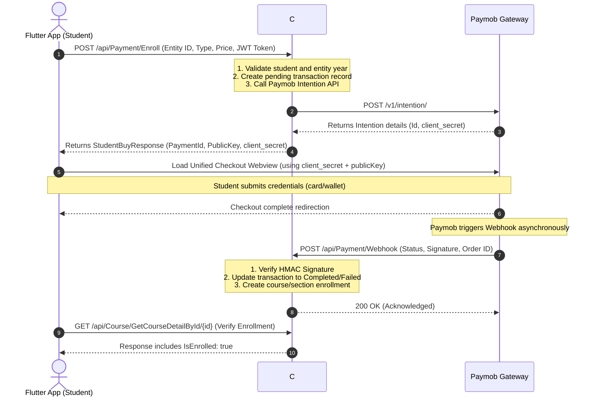

# Paymob Payment Integration Guide for Flutter

This document provides a detailed, step-by-step guide for the Flutter mobile team to integrate payment flows into the mobile application. The system utilizes **Paymob's Unified Checkout (Intentions API)** for processing payments.

---

## Table of Contents
- [Overview of the Payment Flow](#overview-of-the-payment-flow)
- [API Documentation](#api-documentation)
  - [1. Initiate Enrollment and Payment](#1-initiate-enrollment-and-payment)
  - [2. Get Course Details (Check Enrollment)](#2-get-course-details-check-enrollment)
  - [3. Get Section Details (Check Enrollment)](#3-get-section-details-check-enrollment)
- [The `client_secret` Issue & Proposed Backend Fix](#the-client_secret-issue--proposed-backend-fix)
- [Flutter Client Implementation](#flutter-client-implementation)
  - [1. Adding Dependencies](#1-adding-dependencies)
  - [2. Fetching Payment Intent Details](#2-fetching-payment-intent-details)
  - [3. Displaying Paymob Checkout UI (WebView Approach)](#3-displaying-paymob-checkout-ui-webview-approach)
  - [4. Verification Flow](#4-verification-flow)
- [Callback & Webhook Processing](#callback--webhook-processing)
- [Error Codes & Troubleshooting](#error-codes--troubleshooting)

---

## Overview of the Payment Flow

The payment system follows a secure client-server-gateway interaction loop:



---

## API Documentation

### 1. Initiate Enrollment and Payment
Initiates the payment intent for a specific course or section. The backend creates a pending transaction and registers a Payment Intention with Paymob.

*   **Endpoint:** `POST /api/Payment/Enroll`
*   **Controller:** [PaymentController.cs](file:///c:/Users/ASUS/source/EducationalPlatform/Edu_Base/Features/Payment/PaymentController.cs#L16-L36)
*   **Headers:**
    ```http
    Content-Type: application/json
    Authorization: Bearer <Student_JWT_Token>
    ```
*   **Request Body (`PaymentInitiationRequest`):**
    ```json
    {
      "entityId": "e2f7b8c4-1234-5678-9abc-def012345678",
      "entityType": 0, 
      "money": {
        "amount": 250.00,
        "currency": "EGP"
      },
      "paymentMethods": 4925779
    }
    ```
    *   **Field Details:**
        *   `entityId` (*string, UUID*): The ID of the Course or Section to buy.
        *   `entityType` (*int, Enum*): The entity type to purchase:
            *   `0` = Course (defined in [EntityToBuy.cs](file:///c:/Users/ASUS/source/EducationalPlatform/Domain/enums/EntityToBuy.cs#L5))
            *   `1` = Section (defined in [EntityToBuy.cs](file:///c:/Users/ASUS/source/EducationalPlatform/Domain/enums/EntityToBuy.cs#L6))
        *   `money.amount` (*decimal*): Price of the entity (must match the database price).
        *   `money.currency` (*string*): Standard ISO currency code (always `"EGP"`).
        *   `paymentMethods` (*int, Enum*): Paymob integration ID representing the chosen gateway configuration:
            *   `4925779` = Credit/Debit Card (defined in [PaymentMethod.cs](file:///c:/Users/ASUS/source/EducationalPlatform/Domain/enums/PaymentMethod.cs#L6))
            *   `4925809` = Mobile Wallet (defined in [PaymentMethod.cs](file:///c:/Users/ASUS/source/EducationalPlatform/Domain/enums/PaymentMethod.cs#L5))

*   **Success Response (200 OK):**
    ```json
    {
      "value": {
        "studentId": "3fa85f64-5717-4562-b3fc-2c963f66afa6",
        "entityId": "e2f7b8c4-1234-5678-9abc-def012345678",
        "entityToBuy": 0,
        "pamobData": {
          "paymentId": "intention_id_returned_by_paymob",
          "publicKey": "eg_pk_test_...",
          "clientSecret": "intention_client_secret_returned_by_paymob"
        }
      },
      "isSuccess": true,
      "error": null,
      "errorType": 0
    }
    ```
    > [!IMPORTANT]
    > Notice the field is spelled `pamobData` (due to a backend model typo). Keep this in mind when mapping JSON keys in Dart.

---

### 2. Get Course Details (Check Enrollment)
After returning from Paymob checkout, retrieve details of the course to verify if the payment was processed successfully (meaning the webhook has executed).

*   **Endpoint:** `GET /api/Course/GetCourseDetailById/{courseId}`
*   **Controller:** [CourseController.cs](file:///c:/Users/ASUS/source/EducationalPlatform/Edu_Base/Features/Courses/CourseController.cs#L45-L54)
*   **Headers:**
    ```http
    Authorization: Bearer <Student_JWT_Token>
    ```
*   **Success Response Structure (`CourseDetailResponse`):**
    ```json
    {
      "value": {
        "id": "e2f7b8c4-1234-5678-9abc-def012345678",
        "title": "Mathematics Grade 10",
        "price": 250.00,
        "isEnrolled": true,
        ...
      },
      "isSuccess": true,
      "error": null
    }
    ```
    *   **Key Field:** `value.isEnrolled` (*bool*) will switch to `true` once enrollment is processed.

---

### 3. Get Section Details (Check Enrollment)
Similar to courses, check the status of a specific section's enrollment.

*   **Endpoint:** `GET /api/Section/{sectionId}/details`
*   **Controller:** [SectionController.cs](file:///c:/Users/ASUS/source/EducationalPlatform/Edu_Base/Features/Sections/SectionController.cs#L112-L120)
*   **Headers:**
    ```http
    Authorization: Bearer <Student_JWT_Token>
    ```
*   **Success Response Structure (`SectionDetailsQueryModel`):**
    ```json
    {
      "value": {
        "section": {
          "id": "b1f0c2a4-1234-5678-9abc-def012345678",
          "name": "Algebra basics",
          "price": 50.00
        },
        "isEnrolled": true,
        "studentSection": {
          "enrolledAt": "2026-07-18T10:00:00Z",
          "numberOfSectionVideosWatched": 0
        },
        "videos": [...]
      },
      "isSuccess": true,
      "error": null
    }
    ```
    *   **Key Field:** `value.isEnrolled` (*bool*) will switch to `true` once enrollment is processed.

---

## The `client_secret` Issue & Proposed Backend Fix

> [!WARNING]
> In the current backend implementation of [BuyingCommandHandler.cs](file:///c:/Users/ASUS/source/EducationalPlatform/Application/Features/Payment/CreatePaymentIntension/BuyingCommandHandler.cs#L162), the retrieval of the `ClientSecret` from the transaction is commented out, leaving it as an empty string `""` in the API response.
> 
> This happened because `ClientSecret` is not mapped in the SQL database table `payments` ([PaymentTransactions.cs](file:///c:/Users/ASUS/source/EducationalPlatform/Domain/Entities/PaymentTransactions.cs)). The handler is building `StudentBuyResponse` out of the scope of the local variables containing the freshly created Paymob Intention.

### The Fix (Give this to the Backend Team)
To supply the Flutter team with the required `clientSecret`, the backend needs to make a minor change to propagate the `client_secret` from Paymob’s intention creation API:

```diff
 public async Task<Result<StudentBuyResponse>> Handle(BuyingCommand request, CancellationToken cancellationToken)
 {
     ...
     await _unitOfWork.Repository<PaymentTransactions>().AddAsync(payment, cancellationToken);
     await _unitOfWork.SaveChangesAsync(cancellationToken);
 
+    string clientSecret = string.Empty;
+
     if (request.EntityToBuy == EntityToBuy.Course)
     {
         ...
         var Intention = await _paymentService.CreateIntentionAsync(testingPay, cancellationToken);
         if (Intention.Confirmed)
         {
             payment.Amount = (decimal)course.Price!;
             payment.CourseId = course.Id;
             payment.PaymobIntentionId = Intention.Id;
+            clientSecret = Intention.ClientSecret;
         }
         await _unitOfWork.SaveChangesAsync(cancellationToken);
     }
     else
     {
         ...
         var Intention = await _paymentService.CreateIntentionAsync(testingPay, cancellationToken);
         if (Intention.Confirmed)
         {
             payment.Amount = section!.Price!;
             payment.SectionId = section.Id;
             payment.PaymobIntentionId = Intention.Id;
+            clientSecret = Intention.ClientSecret;
         }
         await _unitOfWork.SaveChangesAsync(cancellationToken);
     }
 
     var response = new StudentBuyResponse
     {
         StudentId = request.StudentId,
         EntityId = request.EntityId,
         EntityToBuy = request.EntityToBuy,
         PamobData = new PaymentData
         {
-            //ClientSecret = payment.ClientSecret!,
+            ClientSecret = clientSecret,
             PaymentId = payment.PaymobIntentionId!,
             PublicKey = _paymentService.GetPublicKey()
         }
     };
     return Result<StudentBuyResponse>.Success(response);
 }
```

---

## Flutter Client Implementation

### 1. Adding Dependencies
Add the following dependencies to your `pubspec.yaml`:
```yaml
dependencies:
  dio: ^5.4.0
  webview_flutter: ^4.4.2  # Standard webview for rendering checkout sheet
```

### 2. Fetching Payment Intent Details
Below is the service implementation for interacting with the `/api/Payment/Enroll` endpoint:

```dart
import 'package:dio/dio.dart';

enum EntityToBuy { course, section }

class PaymobIntentData {
  final String paymentId;
  final String publicKey;
  final String clientSecret;

  PaymobIntentData({
    required this.paymentId,
    required this.publicKey,
    required this.clientSecret,
  });

  factory PaymobIntentData.fromJson(Map<String, dynamic> json) {
    return PaymobIntentData(
      paymentId: json['paymentId'] ?? '',
      publicKey: json['publicKey'] ?? '',
      clientSecret: json['clientSecret'] ?? '',
    );
  }
}

class EnrollResponse {
  final String studentId;
  final String entityId;
  final int entityToBuy;
  final PaymobIntentData paymobData;

  EnrollResponse({
    required this.studentId,
    required this.entityId,
    required this.entityToBuy,
    required this.paymobData,
  });

  factory EnrollResponse.fromJson(Map<String, dynamic> json) {
    return EnrollResponse(
      studentId: json['studentId'] ?? '',
      entityId: json['entityId'] ?? '',
      entityToBuy: json['entityToBuy'] ?? 0,
      // Map custom API typo 'pamobData' safely
      paymobData: PaymobIntentData.fromJson(json['pamobData'] ?? {}),
    );
  }
}

class PaymentService {
  final Dio _dio;

  PaymentService(String authToken)
      : _dio = Dio(BaseOptions(
          baseUrl: 'https://your-api-url.com/api',
          headers: {'Authorization': 'Bearer $authToken'},
          connectTimeout: const Duration(seconds: 15),
          receiveTimeout: const Duration(seconds: 15),
        ));

  Future<EnrollResponse?> initiateEnrollment({
    required String entityId,
    required EntityToBuy entityType,
    required double price,
  }) async {
    try {
      final response = await _dio.post(
        '/Payment/Enroll',
        data: {
          'entityId': entityId,
          'entityType': entityType == EntityToBuy.course ? 0 : 1,
          'money': {
            'amount': price,
            'currency': 'EGP',
          },
          // Defaults to Card Integration (4925779)
          'paymentMethods': 4925779,
        },
      );

      if (response.statusCode == 200 && response.data['isSuccess'] == true) {
        return EnrollResponse.fromJson(response.data['value']);
      }
      return null;
    } on DioException catch (e) {
      print('Dio error during payment initiation: ${e.message}');
      if (e.response != null) {
        print('Error details: ${e.response?.data}');
      }
      return null;
    } catch (e) {
      print('Error during payment initiation: $e');
      return null;
    }
  }
}
```

### 3. Displaying Paymob Checkout UI (WebView Approach)
Using the retrieved `publicKey` and `clientSecret`, construct the URL for Paymob's **Unified Checkout** and load it inside a Flutter `WebView`:

```dart
import 'package:flutter/material.dart';
import 'package:webview_flutter/webview_flutter.dart';

class PaymobCheckoutScreen extends StatefulWidget {
  final String publicKey;
  final String clientSecret;

  const PaymobCheckoutScreen({
    Key? key,
    required this.publicKey,
    required this.clientSecret,
  }) : super(key: key);

  @override
  State<PaymobCheckoutScreen> createState() => _PaymobCheckoutScreenState();
}

class _PaymobCheckoutScreenState extends State<PaymobCheckoutScreen> {
  late final WebViewController _controller;
  bool _isLoading = true;

  @override
  void initState() {
    super.initState();

    // Construct the Unified Checkout URL
    final String checkoutUrl =
        'https://accept.paymob.com/unifiedcheckout/?publicKey=${widget.publicKey}&clientSecret=${widget.clientSecret}';

    _controller = WebViewController()
      ..setJavaScriptMode(JavaScriptMode.unrestricted)
      ..setNavigationDelegate(
        NavigationDelegate(
          onPageStarted: (String url) {
            setState(() => _isLoading = true);
          },
          onPageFinished: (String url) {
            setState(() => _isLoading = false);
          },
          onNavigationRequest: (NavigationRequest request) {
            // Intercept checkout completion redirection (e.g. Redirection URL from Paymob config)
            if (request.url.contains('google.com') || request.url.contains('checkout-success')) {
              // Extract status parameters if appended to redirection URL
              bool paymentSuccess = request.url.contains('success=true'); 
              
              // Pop back to the course screen with result
              Navigator.pop(context, paymentSuccess);
              return NavigationDecision.prevent;
            }
            return NavigationDecision.navigate;
          },
        ),
      )
      ..loadRequest(Uri.parse(checkoutUrl));
  }

  @override
  Widget build(BuildContext context) {
    return Scaffold(
      appBar: AppBar(
        title: const Text('Complete Payment'),
        centerTitle: true,
      ),
      body: Stack(
        children: [
          WebViewWidget(controller: _controller),
          if (_isLoading)
            const Center(
              child: CircularProgressIndicator(),
            ),
        ],
      ),
    );
  }
}
```

### 4. Verification Flow
Once the checkout page redirects and you pop the WebView screen, wait a few seconds (to allow the Paymob Webhook to update the database asynchronously) and call the details endpoint:

```dart
void processPaymentFlow(BuildContext context) async {
  final paymentService = PaymentService('STUDENT_JWT_TOKEN');
  
  // 1. Request details from backend
  final enrollData = await paymentService.initiateEnrollment(
    entityId: 'e2f7b8c4-1234-5678-9abc-def012345678',
    entityType: EntityToBuy.course,
    price: 250.00,
  );

  if (enrollData == null) {
    // Show error message
    return;
  }

  // 2. Open WebView checkout
  final bool? success = await Navigator.push<bool>(
    context,
    MaterialPageRoute(
      builder: (context) => PaymobCheckoutScreen(
        publicKey: enrollData.paymobData.publicKey,
        clientSecret: enrollData.paymobData.clientSecret,
      ),
    ),
  );

  // 3. Verify enrollment status from server
  // Wait 2-3 seconds for webhook latency
  await Future.delayed(const Duration(seconds: 3));
  
  // Call course details API check
  final updatedCourse = await fetchCourseDetails(enrollData.entityId);
  if (updatedCourse != null && updatedCourse.isEnrolled) {
     ScaffoldMessenger.of(context).showSnackBar(
        const SnackBar(content: Text('Purchase completed! Welcome to the course.')),
     );
  } else {
     ScaffoldMessenger.of(context).showSnackBar(
        const SnackBar(content: Text('Payment pending verification. Check again soon.')),
     );
  }
}
```

---

## Callback & Webhook Processing

After checkout completion, Paymob fires an asynchronous webhook payload to:
`POST /api/Payment/Webhook`

### Webhook Execution Details
1.  **HMAC Validation:** The backend computes an SHA512 hash on the properties sent by Paymob using the secure HMAC key and compares it to the query parameter `?hmac=...` to ensure transaction integrity.
2.  **State Transition:** 
    *   If payment succeeds (`Success = true`), the `PaymentTransaction.Status` is changed to `PaymentStatus.Completed` (1) and the student enrollment is saved.
    *   If payment fails, status transitions to `PaymentStatus.Failed` (2) and no enrollment occurs.
3.  **Idempotency:** If the transaction status is already marked `Completed`, subsequent calls from Paymob return `200 OK` instantly without executing duplicate enrollments.

---

## Error Codes & Troubleshooting

| HTTP Status | Reason | Recommendation |
| :--- | :--- | :--- |
| **400 Bad Request** | Enrollment in different year, or student missing education year registration. | Ensure user profile is complete and the education year matches. |
| **401 Unauthorized** | Missing or expired JWT Token. | Re-authenticate student and retrieve a fresh JWT. |
| **409 Conflict** | Student is already enrolled in this Course/Section. | Disable "Buy" button on client side if `IsEnrolled` is `true`. |
| **500 Server Error** | Paymob API keys are missing or invalid on server. | Ensure the server has a valid Paymob config setup in `appsettings.json`. |

### Sandbox Cards (For Testing)
Use the following test credentials on the Paymob Unified Checkout form while in sandbox mode:

*   **Card Number:** `4000 1234 5678 9010`
*   **Cardholder Name:** `Test Wallet/Card`
*   **Expiry Date:** Any future date (e.g. `12/30`)
*   **CVV:** `123`
*   **3D Secure OTP:** `1234` (if prompted)
